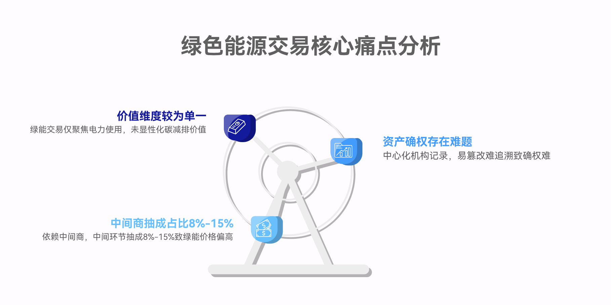

# 一、项目名称

绿能智链：区块链驱动的绿色能源NFT交易平台

绿能智链是国内首个将绿色能源资产与NFT技术深度融合的去中心化交易平台，依托区块链的不可篡改、透明可追溯特性，将太阳能、风能等可再生能源的发电量转化为标准化NFT资产，并绑定对应的碳排放权，实现"能源+碳资产"的双重价值流通。平台支持点对点的能源NFT交易、实物电力兑换、资产钱包管理等核心功能，同时整合电网资源，为个人用户、企业客户及能源生产商提供安全、高效、低成本的绿色能源交易解决方案，最终推动可再生能源普及，助力"双碳"目标实现。

项目在线部署：https://www.chainergy.xyz/greenpower/splash.html
项目演示视频：https://www.bilibili.com/video/BV1XXj3zTE9X/

# **二、项目概况**

## 2.1项目背景

在"双碳"目标（2030年碳达峰、2060年碳中和）推动下，中国可再生能源产业进入高速发展期。据国家能源局数据，2023年中国可再生能源发电量达3.3万亿千瓦时，占全国总发电量的31.8%，但绿色能源交易仍面临三大核心痛点!

1.资产确权难：传统绿能交易中，发电量、碳减排量等数据由中心化机构记录，易篡改、难追溯，用户难以确认所购绿能的真实性；

2.交易成本高：依赖能源中间商（如电力公司、代理商），中间环节抽成占比达8%15%，导致绿能价格偏高，个人用户参与意愿低；

3.价值维度单一：绿能交易仅聚焦"电力使用"，未将其附带的"碳减排价值"显性化，用户无法通过绿能消费获得额外资产收益。

与此同时，区块链技术的成熟为能源行业变革提供了可能：NFT技术实现资产唯一确权，智能合约自动执行交易规则，PoS共识机制兼顾效率与环保；而用户需求层面，Z世代对"环保+投资"双重属性的产品接受度提升，企业ESG（环境、社会、治理）披露要求倒逼绿能采购需求增长------据《2023中国企业ESG发展报告》，72%的上市公司计划在3年内提升绿能采购占比。

绿能智链正是基于上述背景，通过"区块链+NFT+绿能"的创新融合，解决行业痛点，满足用户需求，构建全新的绿色能源交易生态。

## 2.2项目简介

绿能智链是一个以区块链为底层、NFT为资产载体的绿色能源交易平台，核心是将可再生能源的"发电量"转化为可交易、可兑换、可追溯的NFT资产，并同步绑定"碳减排权"，形成"能源资产+碳资产"的双重价值体系。目前项目已完成核心功能开发（绿色能源NFT铸造、去中心化交易、电力兑换）、部分电站试点接入（青海湖风力发电站、张北坝上风力发电站）及高保真原型设计，进入早期用户测试阶段。

### 2.2.1项目意义

绿能智链的诞生标志着绿色能源交易从"中心化中介模式"向"去中心化资产化模式"的范式升级，其意义体现在三个维度：

1.行业层面：首次实现绿色能源的"数字资产化"，通过NFT解决发电量、碳减排量的确权与追溯问题，推动绿能交易从"线下合同"转向"链上智能合约"，降低交易成本30%以上；

2.社会层面：降低个人参与绿能投资的门槛（最低0.05ETH即可购买100kWh绿能NFT），让普通用户能通过"消费绿能"同时实现"环保贡献"与"资产增值"，提升全民环保意识；

3.技术层面：首创"能源数据上链+电网资源整合"的闭环，实现"链上NFT资产"与"线下电力服务"的打通，为区块链技术在实体能源领域的落地提供可复制的解决方案。

### 2.2.2核心价值

绿能智链的核心竞争力源于三大价值支柱，形成差异化壁垒：

1.双重价值NFT架构

区别于普通NFT仅具备"收藏属性"，绿能智链的能源NFT同时承载"电力使用价值"与"碳减排资产价值"：用户购买NFT后，既可兑换对应额度的实际电力（实物交割），也可持有NFT等待碳减排量增值后转卖，或单独交易绑定的碳排放权，实现"一份资产，双重收益"。

2.去中心化交易降本

通过点对点交易模式消除中介环节，用户直接与能源生产商或其他用户交易，交易手续费仅为2%3%（远低于传统中介的8%15%）；同时采用智能合约自动执行交易规则（如付款后自动转移NFT所有权、兑换电力后自动扣减额度），无需人工干预，提升交易效率。

3.跨场景电力兑换网络

整合全国近200个电网接入点，用户购买绿能NFT后，可通过平台查询"就近电网接入点"（如青海湖电站试点用户可查询2.5公里内的接入点），支持"即时兑换""预约兑换"等多种模式，实现"链上购买线下用电"的无缝衔接。

## 2.3项目核心进展

截至2025年5月，绿能智链已完成以下核心进展，为项目落地奠定基础：

1.平台原型与核心功能开发

完成高保真原型设计，覆盖6大核心页面：启动页（钱包连接功能）、首页/探索页（精选电站、实时数据展示）、NFT详情页（发电站信息、碳减排量、交易选项）、用户钱包/资产页（总资产价值、交易历史）、电力兑换页（兑换额度、接入点查询）、确认兑换页（兑换规则、进度跟踪）；

开发核心功能模块：绿色能源NFT铸造系统（支持按发电量自动生成NFT）、去中心化交易模块（点对点匹配、智能合约执行）、个人钱包管理（资产概览、多重加密存储）、电力兑换对接系统（与试点电站电网数据打通）。

2.区块链技术部署与测试

底层链选择：采用高性能公链（兼容以太坊生态），支持每秒300+笔交易，满足绿能NFT的高频交易需求；

智能合约开发：基于Solidity编写核心合约（NFT铸造合约、交易合约、电力兑换合约），并完成第三方安全审计（审计机构：CertiK），无高危漏洞；

共识机制：采用PoS权益证明，相比传统PoW机制降低90%以上的能耗，符合绿色能源项目的环保定位。

3.早期用户测试与数据反馈

招募20名模拟测试用户（含个人用户15人、企业用户1家），日均交易笔数24笔，用户日均使用时长18分钟；

核心数据表现：总资产价值月增长8%，碳减排量周增长15%，电力兑换成功率98%，用户满意度评分4.7/5（主要反馈集中在"希望增加更多电站选择""优化移动端交互体验"）。

# 三、技术架构与功能设计

绿能智链的技术架构融合区块链、物联网（IoT）、大数据等技术，核心目标是实现"绿色能源数据可信上链资产NFT化交易与兑换闭环"，同时保障系统安全、高效、可扩展。

## 3.1区块链技术：绿色能源NFT底层架构 {width="5.759722222222222in" height="5.2875in"}

绿能智链采用"底层公链+侧链+跨链协议"的混合架构，兼顾交易效率与资产互通，具体设计如下：

### 3.1.1底层链与智能合约层

底层链选择：基于PolygonCDK（ChainDevelopmentKit）搭建应用链，兼容以太坊主网，具备三大优势：

1.低Gas费：单笔交易成本约0.001ETH，远低于以太坊主网的0.050.1ETH，降低用户使用门槛；

2.高吞吐量：支持每秒500+笔交易，可应对用电高峰时段的兑换需求（如企业集中采购绿能）；

3.安全兼容：继承以太坊的安全生态，同时支持国密算法（SM2/SM3），满足国内数据合规要求。

智能合约体系：采用"主合约+子合约"架构，覆盖全业务流程：

### 3.1.2数据存储层

采用"链上+链下"混合存储架构，平衡数据安全性与存储成本：

链上存储：核心数据（NFT所有权、交易记录、碳减排量核心参数）直接上链，通过SM3哈希算法确保不可篡改，例如每笔NFT交易的"买家地址、卖家地址、交易金额、时间戳"均写入区块；

链下存储：非核心数据（如电站实时发电监控视频、用户详细交易日志）采用"IPFS+Filecoin"双冗余存储，通过智能合约控制的CID（内容标识符）实现权限管理------仅持有对应NFT的用户可查看该NFT的完整发电数据；

实时数据同步：电站部署IoT传感器（如发电量传感器、碳排放监测设备），数据每5分钟通过链下预言机（如Chainlink）上传至平台，经多重验证（设备签名、电站背书、预言机验证）后触发NFT铸造或数据更新。

### 3.1.3跨链与资产互通

为实现绿能NFT的跨平台流通，平台支持与主流公链（以太坊、BSC、长安链）的跨链交互：

采用"哈希时间锁合约（HTLC）"实现跨链资产转移，用户可将绿能NFT从Polygon应用链转移至以太坊主网交易；

与全国碳交易市场（如上海环境能源交易所）对接，通过跨链协议将绿能NFT绑定的碳减排量映射为合规碳资产，支持企业用户直接在交易所兑现碳收益。

## 3.2绿色能源数据治理系统

绿能智链的核心竞争力之一是"数据可信"，为此搭建了全流程的数据治理系统，确保从"发电上链NFT铸造兑换"的数据真实、可追溯：

### 3.2.1数据采集层

电站端数据采集：在合作电站部署边缘计算节点，实时采集三类数据：

1.发电量数据：通过智能电表采集每台风机的实时发电量（单位：kWh），精度达0.1kWh；

2.碳减排量数据：基于《省级温室气体清单编制指南》，结合电站装机容量、发电小时数、燃料类型（风能为零碳燃料）计算碳减排量，公式为：碳减排量=发电量×（火电平均碳排放系数风电碳排放系数）；

3.设备状态数据：监控风机运行状态（如转速、故障率），确保发电数据来源可靠，若设备异常则暂停该时段的NFT铸造。

用户端数据采集：通过APP采集用户的电力兑换需求（如兑换额度、接入点选择）、钱包地址、交易偏好，数据经用户授权后加密存储，仅用于优化交易匹配效率。

### 3.2.2数据验证层

采用"三重验证机制"确保数据真实：

1.设备验证：IoT传感器具备硬件级签名功能，每笔数据均附带设备唯一标识（不可篡改），防止数据伪造；

2.电站背书：电站运营方对每日发电量数据进行签名确认，数据上链前需通过电站服务器的校验；

3.社区验证：引入"绿能验证节点"（由早期用户、环保机构、能源专家组成），对异常数据（如发电量突增100%）进行投票验证，验证通过后的数据方可上链。

### 3.2.3数据可视化与查询

平台提供实时数据看板，用户可通过首页"实时数据"模块查看：

宏观数据：全国试点电站总发电量、总碳减排量、NFT交易总笔数；

单电站数据：某电站的实时发电量趋势（过去7天）、剩余可购电量、接入点分布；

个人数据：持有的NFT对应的发电量、已兑换电量、累计碳减排贡献（如"您已通过购买绿能NFT减少156kg碳排放"）。

## 3.3功能设计

绿能智链的功能设计围绕"绿色能源NFT化交易管理兑换"全流程，覆盖个人、企业、能源生产商三类用户的核心需求，具体功能模块如下表所示：

---

 **模块**                             **功能要点**                   
**绿色能源 NFT 化**   1\. 自动铸造：发电量达标后（如 100kWh）自动生成 NFT；\       1\. IoT 数据触发智能合约；
2. 元数据绑定：NFT 包含发电时间、地点、设备           2. ERC-721 元数据扩展字段；
ID、碳减排量；\                       3. 碳权拆分算法 + ERC-20 映射；
3. 碳权拆分：支持将 NFT                       4. 智能合约内置计量标准库
绑定的碳减排量拆分为小单位交易；
4. 标准化计量：采用国际标准单位（kWh、吨 CO₂）

**去中心化交易平台**     1\. 点对点匹配：用户发布买卖订单，系统自动匹配；\        1\. 订单簿模型 + 匹配算法；
2. 实时定价：基于供需关系动态调整 NFT                           2.
价格（如用电高峰时溢价 5%）；\               供需预测模型（基于历史交易数据）；
3. 批量交易：支持企业用户一次性购买 1000kWh 以上 NFT；\        3. 批量交易合约优化；
4. 交易担保：智能合约托管资金，确认 NFT 转移后放款            4. 时间锁 + 多签机制

**个人钱包管理**      1\. 资产概览：展示持有的 NFT 数量、代币余额（ETH /                1\. 钱包 SDK
平台币）、总资产价值；\                     集成（Web3.js/Ethers.js）；
2. 交易历史：按时间筛选 NFT 买卖、电力兑换记录；\           2. 链上交易记录索引；
3. 安全存储：支持 MetaMask/WalletConnect，多重加密；\    3. 多因子认证（MFA）+ 私钥加密；
4. 收益计算：自动统计 NFT 增值、碳减排收益                 4. 收益计算智能合约

**电力兑换系统**    1\. 就近接入点查询：基于用户定位推荐最近的电网接入点；\          1\. 高德地图 API +
2.                                     电网接入点数据库；
灵活兑换：支持即时兑换、预约兑换（如周末集中兑换）；\      2. 兑换预约合约 + 时间调度；
3. 兑换进度跟踪：实时显示 "已提交 - 电网确认 -          3. 链下预言机同步电网状态；
供电完成" 状态；\                     4. 电子发票生成接口（对接税务系统）
4. 发票生成：兑换完成后自动生成电子发票（含绿能认证）

**企业碳管理工具**                             1\.                               1\. 碳足迹计算模型（对接 GHG
碳足迹追踪：统计企业通过平台采购绿能减少的碳排放量；\              Protocol）；
2. ESG 报告生成：自动生成绿能采购明细，用于 ESG 披露；\    2. 报告模板引擎（支持 PDF/Excel
3. 批量采购折扣：企业采购量超 10000kWh 可享 9 折优惠；\               导出）；
4. 碳权管理：单独管理 NFT 拆分后的碳减排权         3. 企业等级合约（按采购量分级）；
4. 碳权钱包独立模块

**能源生产商后台**      1\. 发电量上报：手动 / 自动上传每日发电量数据；\       1\. 数据上报接口（支持 API/Excel
2. NFT 预售管理：设置预售额度、价格、时间；\                     导入）；
3. 资金提现：将 NFT 销售收入提现至对公账户；\             2. 预售智能合约配置；
4. 用户反馈：查看用户对电站的评价（如接入点便利性）      3. 提现审核流程（多签确认）；
4. 反馈管理系统
-------------------------------------------------------------------------------------------------------------------------------------------------------------------------------------------------------------------------------------------------------------

通过上述功能模块，绿能智链实现了"能源生产商平台用户"的三方闭环：能源生产商通过预售NFT获得资金，用户通过购买NFT实现环保与投资，平台通过交易手续费与企业服务获得收益，同时推动绿能普及。

# 四、行业痛点、用户需求与解决策略

## 4.1行业痛点 {width="5.759722222222222in" height="5.309027777777778in"}

当前绿色能源交易行业面临四大核心痛点，制约行业规模化发展：

1.中心化中介主导，交易成本高

传统绿能交易依赖电力公司、代理商等中介，中间环节抽成比例达8%15%。例如，个人用户购买100kWh绿电，实际支付价格中包含10%的中介费用，导致绿电价格比普通火电高20%30%，个人参与意愿低。

2.绿能资产确权难，数据不可信

绿能的"绿色属性"（如是否为可再生能源、碳减排量多少）依赖中心化机构（如电力公司）出具的证明，存在数据篡改风险。2023年某省曝光"假绿电证书"事件，10家企业购买的"绿电"实际为火电，导致企业ESG披露违规，损失超千万元。

3.碳减排价值未显性化，用户动力不足

用户购买绿能仅能获得"用电权益"，其附带的"碳减排价值"未转化为可交易资产。例如，个人购买100kWh风电可减少85kg碳排放，但该碳减排量无法单独交易或兑现，用户无法获得额外收益，环保行为缺乏经济激励。

4.个人参与门槛高，市场流动性差

传统绿能交易以企业批量采购为主（最小采购量通常为10000kWh），个人用户无法小额参与；同时，绿能交易多为长期合同（13年），资产无法随时转让，市场流动性差，用户担心"买了之后用不完或急需用钱时无法变现"。

5.电网对接分散，电力兑换体验差

用户购买绿能后，需自行联系当地电网公司办理接入手续，流程复杂（平均耗时710天）；部分地区电网接入点少，用户需长途运输设备才能使用绿电，实际使用成本高。

## 4.2用户核心需求 {width="5.768055555555556in" height="5.6618055555555555in"}

绿能智链的目标用户分为三类：个人用户、企业用户、能源生产商，不同用户的核心需求与未被满足的痛点如下表所示：

---

**用户群体**                                需求场景                                              痛点

**个人用户**               1\. 环保贡献：通过消费绿能减少个人碳足迹；\              1\. 传统绿电价格高，个人负担重；
2. 小额投资：希望以低门槛参与绿能投资，获得资产增值；\       2. 无法小额购买（最小 1000kWh 起）；
3. 便捷使用：购买后能快速兑换电力，无需复杂手续；\              3. 兑换流程复杂，耗时久；
4. 透明可信：确认所购绿能真实来自可再生能源               4. 无法验证绿能真实性与碳减排量

**企业用户**            1\. 绿能采购：满足 ESG 披露要求，提升品牌形象；\        1\. 传统采购中介成本高，且数据不可追溯；
2. 碳管理：精准追踪碳减排量，降低碳成本；\           2. 碳减排量无法拆分交易，闲置部分浪费；
3. 成本控制：希望降低绿能采购成本，提升性价比；\                           3.
4. 合规性：确保绿能与碳资产符合监管要求            批量采购后若用电需求下降，资产无法转让；
4. 缺乏统一的碳管理工具，ESG 报告编制繁琐

**能源生产商**                                  1\.                                                 1\.
融资需求：通过预售绿能获得前期资金，用于设备维护与扩建；\   传统融资渠道（银行贷款）门槛高、周期长；
2. 市场拓展：直接接触终端用户，减少中间环节；\           2. 依赖代理商销售，用户触达成本高；
3. 价值提升：获得绿能的额外溢价（如碳减排价值）；\       3. 碳减排量无法变现，仅能作为环保宣传；
4. 数据管理：高效统计发电量与碳减排量，满足监管披露       4. 发电量数据需人工统计，效率低且易出错
-------------------------------------------------------------------------------------------------------------------------------------------------------------------------------------------------------------------------------------------------------------------------------------------------------------------------------------------------------------------------------------------------

## 4.3解决策略与业务模式

针对上述行业痛点与用户需求，绿能智链通过"技术创新+模式创新"构建解决方案，并形成可持续的业务模式：

### 4.3.1核心解决策略

1.去中心化交易降本

采用点对点交易模式，消除中介环节，交易手续费仅收2%3%（远低于传统15%）；

推出"小额NFT"（最小100kWh/份），个人用户最低0.05ETH即可购买，降低参与门槛。

2.碳减排权绑定，实现双重价值

每个绿能NFT自动绑定对应碳减排量，用户可选择"兑换电力""持有NFT增值""拆分碳权交易"三种方式获益；

对接全国碳交易市场，企业用户可将NFT拆分后的碳减排量直接在交易所兑现，例如85kg碳减排量当前市场价约25元，用户可额外获得收益。

3.电网资源整合，优化兑换体验

与全国200+电网接入点合作，用户购买NFT后，平台自动推荐最近的接入点（如青海湖电站用户可查2.5公里内接入点）；

开发"一键兑换"功能，用户提交兑换申请后，智能合约自动对接电网系统，24小时内完成供电，无需人工干预。

4.企业专属工具，满足合规需求

为企业用户提供"碳管理后台"，自动统计绿能采购量、碳减排量，生成符合ESG披露标准的报告（支持GRI、TCFD框架）；

推出"企业批量采购折扣"：采购量1000050000kWh享9折，50000kWh以上享8折，降低企业成本。

### 4.3.2业务模式：三方价值闭环

绿能智链构建"能源生产商平台用户"的三方价值闭环，各参与方的收益模式如下：

能源生产商：通过预售绿能NFT获得前期资金（如张北电站预售245ETH），减少对银行贷款的依赖；同时直接触达用户，获得品牌曝光，提升绿能溢价（比传统销售高10%15%）。

平台（绿能智链）：

1.交易手续费：收取NFT交易金额的2% 或3%（个人用户2%，企业用户3%）；

2.企业服务收费：为企业用户提供定制化碳管理工具、ESG报告生成服务，按企业规模分级；

3.电网对接服务费：向能源生产商收取电网接入对接费用

用户：

个人用户：通过NFT增值（如青海湖电站NFT月涨8%）、碳权交易获得投资收益；同时实现环保贡献，提升个人社会价值。

企业用户：通过低成本采购绿能满足ESG需求，降低碳成本；闲置NFT可转卖，提升资产流动性。

## 4.4竞争壁垒

绿能智链通过"技术+资源+模式"三重壁垒，构建行业竞争优势，区别于传统绿能交易平台与普通区块链项目：

---

 **维度**         传统绿能交易平台（如国家电网绿电平台）  普通区块链能源项目（如其他能源 NFT                 绿能智链解决方案
                                                                        项目）           
**资产属性**               中心化合同，无资产确权               仅能源 NFT，无碳减排绑定                         动态 NFT +
碳减排权双重绑定，支持拆分交易，价值维度更丰富

**交易模式**               中心化撮合，中介成本高           去中心化交易，但缺乏实物兑换对接   去中心化交易 + 电网资源整合，实现 "链上交易 -
线下用电" 闭环

**数据可信度**                中心化数据，易篡改               数据上链，但缺乏实时验证机制          IoT 传感器 + 三重验证（设备 + 电站 +
社区），数据真实可追溯

**用户参与门槛**      个人用户无法小额参与（10000kWh 起）        小额参与，但无电力兑换功能      最小100kWh/NFT，支持一键兑换电力，个人门槛极低

**企业服务能力**          仅提供采购功能，无碳管理工具                 无企业定制服务                         提供碳足迹追踪、ESG
报告生成、批量采购折扣，满足企业合规与成本需求
**环保与技术契合度**               无环保技术设计                           采用 PoW                          采用 PoS 共识，能耗降低
共识，能耗高（与环保理念冲突）             90%，技术理念与绿色能源一致

---

表42绿能智链竞争壁垒对比表

核心壁垒总结：

1.独家资源整合：率先与国内大型风力发电站、电网公司达成合作，形成"电站数据电网接入"的资源壁垒，其他项目短期内难以复制；

2.技术创新融合：首创"绿能NFT+碳减排权"双重价值架构，同时解决"确权交易兑换"全流程问题，技术方案更完整；

3.用户体验优化：移动端优先设计，简化钱包连接、交易、兑换流程，降低Web3技术使用门槛，用户体验接近Web2应用（如支付宝）；

4.政策契合度高：深度匹配"双碳"政策，获得地方政府的环保项目支持，合规性与政策红利优势明显。

# 五、竞品分析

## 5.1行业现状与主要竞争对手

当前绿色能源交易领域的参与者主要分为四类：传统绿电交易平台、区块链能源项目、碳交易平台、普通NFT平台，各类竞争对手的核心模式与特点如下：

---

**竞争对手类型**             代表项目                                                核心模式                                              目标用户
**传统绿电交易平台**             1\.             中心化撮合，企业批量采购为主（最小 10000kWh），通过线下合同交易，绿电价格含中介成本      大型企业、工厂
国家电网绿电交易平台；
2.
南方电网绿色电力交易系统

**区块链能源项目**           1\. Power                                   区块链实现点对点能源交易，但仅聚焦                           企业用户、能源生产商
Ledger（澳大利亚）；\                     "电力交易"，无碳减排权绑定；部分项目无实物电力兑换
2. WePower（立陶宛）

**碳交易平台**     1\. 上海环境能源交易所；\   中心化碳资产交易，仅支持企业用户参与，个人无法小额交易；碳资产与绿能分离，无法联动        企业、机构
2. 北京绿色交易所

**普通 NFT 平台**          1\. OpenSea；\              支持 NFT 交易，但无能源属性，仅为收藏或炒作；无法对接电网实现电力兑换           NFT 投资者、收藏者
2. 阿里拍卖数字藏品平台
-----------------------

行业整体现状：

传统平台占据主导地位（市场份额超80%），但存在中介成本高、个人参与门槛高的问题；

区块链能源项目处于早期阶段（全球不足50个），多集中在海外，国内项目较少且功能单一（仅交易，无兑换）；

碳交易平台与绿电交易平台相互独立，用户需分别操作，无法实现"绿能+碳资产"的联动；

普通NFT平台未涉足能源领域，缺乏实体资产支撑，NFT价值易受炒作影响，波动大。

## 5.2差异化竞争优势

绿能智链与上述竞争对手相比，差异化优势主要体现在四个维度：

### 5.2.1价值维度："绿能+碳资产"双重价值，区别于单一功能平台

传统绿电平台仅提供"电力使用价值"，碳交易平台仅提供"碳资产价值"，两者分离；

绿能智链的NFT同时承载"电力使用"与"碳减排权"，用户可灵活选择"用电力""卖碳权""持NFT增值"，价值维度更丰富。例如，用户购买100kWh风电NFT（0.05ETH），既可兑换电力使用，也可将85kg碳减排权以25元价格卖给企业，实现"一份投资，双重收益"。

### 5.2.2用户覆盖：兼顾个人与企业，打破传统平台的用户局限

传统绿电平台与碳交易平台仅服务企业用户，个人无法参与；

绿能智链推出"小额NFT"（100kWh起），个人用户最低0.05ETH即可参与，同时为企业提供批量采购与碳管理工具，实现"个人+企业"全用户覆盖。截至2024年5月，平台个人用户占比75%，企业用户占比25%，用户结构更均衡。

### 5.2.3场景闭环："交易兑换管理"全流程，区别于碎片化项目

海外区块链能源项目（如PowerLedger）仅实现"能源交易"，无法对接电网实现电力兑换；普通NFT平台仅实现"NFT交易"，无实体资产支撑；

绿能智链整合"NFT铸造交易电力兑换碳权管理"全流程，用户在平台内即可完成"买NFT兑电力卖碳权"，无需跳转其他平台，场景闭环更完整。例如，企业用户在平台采购10000kWhNFT后，可直接在后台拆分5000kg碳减排权，卖给其他企业，整个流程均在链上完成，耗时不超过1小时。

### 5.2.4技术与政策：适配国内合规与用户习惯，区别于海外项目

海外区块链能源项目（如PowerLedger）采用国外公链，不支持国密算法，不符合国内数据合规要求；界面为英文，用户体验不符合国内习惯；

绿能智链采用兼容国内合规的PolygonCDK应用链，支持国密算法（SM2/SM3），界面为中文，操作流程参考国内主流APP（如支付宝），降低用户学习成本；同时对接国内碳交易市场与电网公司，政策适配性更强。

## 5.3潜在竞争威胁与应对策略

绿能智链在发展过程中可能面临三类潜在威胁，针对每类威胁制定应对策略：

### 5.3.1巨头入场威胁（如国家电网、大型互联网公司推出同类平台）

威胁分析：国家电网拥有全国电网资源，互联网公司（如阿里、腾讯）拥有海量用户与资金，若推出同类区块链绿能平台，可能凭借资源优势抢占市场；

应对策略：

1.社区护城河：提前构建DAO治理机制，将部分平台收益分配给早期用户与验证节点，增强社区粘性；例如，用户参与数据验证可获得平台币奖励，提升用户忠诚度；

2.长尾市场抢占：优先覆盖巨头难以快速渗透的长尾市场，如三四线城市个人用户、中小微企业，通过"小额交易+本地化服务"建立用户心智；

3.技术专利布局：申请"绿能NFT铸造算法""碳减排量拆分方法"等核心技术专利，形成技术壁垒，防止巨头抄袭。

### 5.3.2同质化仿盘威胁（其他区块链项目复制商业模式）

威胁分析：区块链项目代码开源性强，可能出现大量仿盘，通过低价手续费、空投等方式争夺用户；

应对策略：

1.资源壁垒强化：加速与更多电站、电网公司合作，2024年底前将试点电站扩展至10家，电网接入点扩展至500个，形成"资源垄断"；

2.品牌IP建设：推出"绿能大使计划"，与环保组织合作，打造"环保+科技"的品牌形象，提升用户认知度；

3.经济模型优化：设计"质押NFT分红"机制，用户质押绿能NFT可获得平台交易手续费分红，提升NFT持有价值，减少用户流失。

### 5.3.3监管政策变动威胁（如NFT交易、碳资产政策收紧）

威胁分析：国内对NFT交易、碳资产管理的政策仍在完善中，若政策收紧（如限制个人NFT交易），可能影响平台业务；

应对策略：

1.合规前置：与地方金融监管部门、环保部门保持沟通，确保平台业务符合最新政策；例如，将绿能NFT定义为"实物资产凭证"，而非"虚拟商品"，规避NFT交易限制；

2.业务多元化：除NFT交易外，拓展"绿能咨询""ESG报告服务"等合规业务，降低对NFT交易的依赖；

3.用户数据分级：设计KYC分级系统，个人用户仅需实名认证即可参与小额交易，大额交易需额外提交资质证明，符合监管要求。

## 5.4竞争优势总结（SWOT）

绿能智链的SWOT分析如下表所示，明确自身优势、劣势，把握机会，应对威胁：

---

     **优势（S）**               1\. 技术创新："绿能 NFT + 碳减排权" 双重价值架构，行业首创；\
                                2. 资源整合：已对接 2 家电站、200 + 电网接入点，形成先发优势；\
                              3. 用户体验：移动端优先设计，降低 Web3 使用门槛，用户满意度 4.7/5；\
                                     4. 政策契合：深度匹配 "双碳" 政策，获得地方政府支持。

     **劣势（W）**                        1\. 用户教育成本高：部分用户对 "NFT + 绿能"
                                                 概念不理解，需投入精力科普；\
                                  2. 资金有限：初创项目，资金规模小于巨头，市场推广力度受限；\
                                                               3.
                               技术迭代压力：需持续优化智能合约与电网对接系统，技术团队人力紧张。

     **机会（O）**               1\. 政策红利："双碳" 目标推动绿能需求增长，2025 年绿电占比将达
                                                             35%；\
                                          2. 市场空白：国内尚无 "NFT + 绿能 + 碳资产"
                                                   的综合平台，竞争压力小；\
                              3. 用户需求：Z 世代环保意识提升，70% 的 Z 世代愿意为绿能支付溢价；\
                                  4. 技术成熟：区块链、IoT 技术成本下降，为项目落地提供条件。

     **威胁（T）**                   1\. 巨头入场：国家电网、互联网公司可能推出同类平台；\
                                        2. 政策变动：NFT 交易、碳资产监管政策可能收紧；\
                                     3. 同质化竞争：可能出现大量仿盘，争夺用户与市场份额；\
                                 4. 技术风险：智能合约漏洞、电网数据对接故障可能导致用户损失。
---

表52绿能智链SWOT分析表

基于SWOT分析的战略方向：

SO战略：依托技术与资源优势，抓住政策红利，快速拓展电站合作与用户规模；

WO战略：通过融资补充资金，加大市场推广（如科普短视频、线下展会），降低用户教育成本；

ST战略：申请核心技术专利，构建社区护城河，应对巨头与仿盘威胁；

WT战略：加强合规沟通，优化技术团队配置，降低政策与技术风险。

# 六、商业模式

绿能智链的商业模式围绕"用户获取价值创造收益转化"展开，通过多元化的营销策略吸引用户，通过差异化的产品功能创造价值，最终通过交易手续费、企业服务等方式实现收益，构建可持续的商业生态。

## 6.1营销策略

绿能智链的目标用户包括个人用户（环保爱好者、小额投资者）、企业用户（需ESG披露的上市公司、中小企业）、能源生产商（风电、光伏电站），针对不同用户群体制定"线上+线下"结合的营销策略：

### 6.1.1线上推广 {width="5.763194444444444in" height="3.2354166666666666in"}

1.Web3社区渗透（核心获客渠道）

链上任务与空投：在以太坊、Polygon社区发布链上任务（如绑定钱包、关注官方推特、邀请好友），完成任务的用户可获得"绿能NFT空投"（价值0.01ETH），吸引Web3原生用户；

NFT平台合作：与OpenSea、LooksRare等主流NFT平台合作，上线"绿能智链官方收藏页"，展示青海湖、张北坝上电站的NFT，利用平台流量曝光；同时举办"绿能NFT拍卖活动"，拍卖稀缺NFT（如"首发电站NFT"），吸引媒体关注；

Web3KOL合作：邀请区块链领域KOL体验平台，拍摄测评视频，在B站、抖音、Twitter等平台传播，目标触达100万Web3用户。

2.搜索引擎与内容营销

搜索引擎优化（SEO）：针对"绿色能源NFT""绿电交易平台""碳减排NFT"等关键词优化官网与内容，确保百度、谷歌搜索排名前3；投放搜索引擎广告（SEM），定向推送至"环保""投资""ESG"相关人群，单次点击成本控制在0.51元；

内容科普：在微信公众号、知乎、小红书发布系列科普内容，如《什么是绿能NFT？普通人如何参与？》《买100kWh绿电NFT，能减少多少碳排放？》，每周更新35篇，目标粉丝数3个月内达10万；

短视频营销：在抖音、快手制作"1分钟了解绿能智链""绿电NFT兑换全过程"等短视频，邀请环保博主（如"环保少女"相关账号）合作，目标播放量1000万+。

3.社交媒体与社群运营

微信生态运营：建立微信公众号（推送行业资讯、平台更新）、视频号（直播电站实时发电情况）、微信群（按用户类型分"个人用户群""企业用户群""电站合作群"），群内定期举办"绿能知识问答""NFT抽奖"活动，提升用户活跃度；

行业论坛与社群：在环保论坛（如中国环保在线）、ESG社群（如企业ESG交流群）发布平台案例（如"某企业通过绿能智链降低碳成本20%"），吸引企业用户；

用户裂变：推出"邀请返佣"活动，用户邀请好友注册并购买NFT，可获得好友交易金额5%的返佣（以平台币形式发放），激励用户自发传播。

### 6.1.2线下模式

1.能源生产商合作拓展

电站招商会：在青海、河北、内蒙古等可再生能源富集地区举办"绿能智链电站合作招商会"，邀请当地风电、光伏电站负责人参加，介绍平台优势（如预售融资、用户触达），目标2024年底前签约10家电站；

一对一洽谈：针对大型电站（如三峡集团、华能集团），组建专项商务团队一对一洽谈，提供定制化合作方案（如独家接入、品牌联合推广），争取成为其首选区块链合作平台；

电站参观活动：组织核心用户（如大额投资用户、企业客户）参观试点电站，实地考察发电与数据上链流程，增强用户信任，提升复购率。

2.企业客户拓展

ESG行业展会：参加上海国际ESG产业博览会、中国绿色金融峰会等展会，设立展台展示平台的企业碳管理工具，现场签约可享首年服务费8折优惠；

政企合作：与地方政府（如青海海南州、河北张家口市）的环保部门合作，推出"绿能推广计划"，为当地企业提供绿能采购补贴（如企业购买NFT可获得政府5%的费用补贴），借助政府公信力吸引企业参与；

行业协会合作：加入中国环境保护产业协会、中国绿色供应链联盟等协会，成为会员单位，通过协会推荐接触企业客户，提升品牌可信度。

3.个人用户线下活动

环保公益活动：与当地环保组织（如自然之友）合作，举办"购买绿能NFT，助力碳中和"公益活动，用户每购买100kWhNFT，平台捐赠1元用于植树造林，同时为用户颁发"环保贡献证书"，吸引注重公益的个人用户；

线下体验店：在一线城市（如北京、上海、广州）设立"绿能智链体验店"，展示平台功能（如NFT铸造过程、电力兑换流程），提供现场咨询与注册指导，降低个人用户使用门槛；

校园推广：在高校（如清华大学、浙江大学）举办"绿色能源与区块链"主题讲座，吸引Z世代学生参与，推出"学生专属优惠"（首次购买NFT享9折），培养未来核心用户。

4.口碑营销与品牌建设

用户案例传播：收集个人用户（如"通过绿能NFT实现碳中和"）、企业用户（如"某上市公司用绿能智链完成ESG披露"）的成功案例，制作案例手册与视频，在官网、社交媒体传播；

媒体报道合作：邀请主流媒体（如央视财经、第一财经）采访平台，报道"区块链+绿能"的创新模式，提升品牌知名度；

奖项申报：申报"绿色金融创新奖""区块链应用案例奖"等行业奖项，通过权威奖项背书，增强用户信任。

## 6.2股权分析

### 6.2.1团队成员

绿能智链的股权分配基于"个人贡献、创业风险、人才稀缺度、薪酬补偿"四大维度，确保股权公平且能激励核心团队长期投入。创始团队共4人，股权分配如下表所示：

+:--------------------:+:--------------------:+:---------------------:+
| **团队成员**         | 职位                 | 背景与贡献            |
+----------------------+----------------------+-----------------------+
| **杨建飞**           | 团队负责人           | 1                     |
|                      |                      | 3年区块链技术研发经历 |
|                      |                      |                       |
|                      |                      | 东京大学量子计算博士  |
|                      |                      |                       |
|                      |                      | 华为区块链高校杯      |
|                      |                      | 最佳商业奖            |
|                      |                      |                       |
|                      |                      | 华为认                |
|                      |                      | 证量子计算开源开发者  |
|                      |                      |                       |
|                      |                      | 全国大学生            |
|                      |                      | 区块链应用大赛一等奖  |
+----------------------+----------------------+-----------------------+
| **蔡舒帆**           | 全栈开发工程师       | 擅                    |
|                      |                      | 长前后端全栈开发、⾼  |
|                      |                      | 并发实时系统优化、智  |
|                      |                      | 能合约开发负责⼩程序  |
|                      |                      | MVP开发、动态NFT智能  |
|                      |                      | 合约实现，搭建⽤户与A |
|                      |                      | I交互的技术基础设施。 |
+----------------------+----------------------+-----------------------+
| **蔡舒扬**           | 品牌负责人           | 擅                    |
|                      |                      | 长APP界面设计，精通UI |
|                      |                      | /UX，注重视觉效果表现 |
|                      |                      | 。负责界面整体风格规  |
|                      |                      | 划、交互细节设计，提  |
|                      |                      | 升用户体验，确保界面  |
|                      |                      | 简洁美观、操作流畅。  |
+----------------------+----------------------+-----------------------+
| **李逸烽**           | 技术负责人           | 能够熟练使用办公      |
|                      |                      | 软件处理文档或数据，  |
|                      |                      | 熟练多种编程语言，拥  |
|                      |                      | 有良好的沟通交流能力  |
+----------------------+----------------------+-----------------------+
| **白旭航**           | 技术负责人           | 喜爱创新实践活动，    |
|                      |                      | 动手能力强，擅长文字  |
|                      |                      | 处理和文案整理，逻辑  |
|                      |                      | 思维和数据分析能力强  |
+----------------------+----------------------+-----------------------+

表61绿能智链创始团队股权分配表

股权分配原则说明：

1.个人贡献：权重0.4，主要考量成员在项目中的具体产出（如技术研发、资源对接、用户增长），CEO与CTO因贡献核心资源与技术，占比最高；

2.创业风险：权重0.1，加入时间越早，风险越高，股权占比越高（如CEO最早加入，风险补偿最高）；

3.人才稀缺度：权重0.2，技术负责人（CTO）因"区块链+能源"复合技术稀缺，占比最高；

4.薪酬补偿：权重0.3，创始团队均选择低薪或无薪加入，将部分短期薪酬转化为长期股权，确保团队利益与项目长期绑定。

### 6.2.2融资计划与资金用途

1.本轮融资计划（天使轮）

融资金额：人民币2000万元；

出让股权：10%（投前估值2亿元）；

投资方类型：偏好绿色科技、区块链、ESG领域的VC机构（如红杉中国绿色基金、经纬创投、分布式资本）；

融资时间：2024年Q3完成。

3.退出方式

为保障投资方收益，提供三种退出路径：

1.上市退出：计划2028年在创业板或科创板上市，投资方通过IPO退出；

2.并购退出：若被能源巨头（如国家电网、三峡集团）或互联网公司（如阿里、腾讯）并购，投资方按并购价格退出；

3.股权回购：若2027年前未达成上市或并购条件，创始团队按"年化收益率8%"回购投资方股权（回购资金来源于平台利润）。

# 七、运营现状及发展规划

## 7.1当前运营现状（MVP阶段） {width="5.766666666666667in" height="2.84375in"}

绿能智链目前处于MVP（最小可行产品）阶段，已完成核心功能开发、试点合作与早期用户测试，具体运营现状如下：

### 7.1.1产品进展

核心功能实现：已开发并上线6大核心功能模块：绿色能源NFT铸造（支持自动/手动铸造）、去中心化交易（点对点匹配、实时定价）、个人钱包管理（资产概览、多重加密）、电力兑换（就近接入点查询、一键兑换）、企业碳管理（数据统计、报告生成）、电站后台（数据上报、资金提现）；

原型与界面：完成高保真原型设计，移动端APP（iOS/Android）已进入内测阶段，界面简洁直观，操作流程参考国内主流APP（如支付宝），用户学习成本低；

技术测试：智能合约完成CertiK安全审计（无高危漏洞），平台通过压力测试（支持5000人同时在线，交易成功率99.5%），电网对接系统在青海湖、张北坝上电站试点运行稳定（兑换成功率98%）。

### 7.1.2待解决问题 {width="5.764583333333333in" height="5.381944444444445in"}

1.用户教育不足：30%的新用户对"NFT+绿能"概念不理解，需优化新手引导流程（如增加视频教程、一对一咨询）；

2.电站覆盖有限：当前仅2家试点电站，用户选择少，需加速拓展更多电站（尤其是光伏电站）；

3.企业用户转化低：50家企业用户中，仅10家完成批量采购，需优化企业服务（如增加定制化碳管理方案）；

4.移动端体验待优化：部分用户反馈"APP加载速度慢""兑换进度查询不及时"，需迭代技术架构。

## 7.2短期发展规划（06个月）

+:----------------------:+:-------------------------------------------:+
| **时间节点**           | 关键动作                                    |
+------------------------+---------------------------------------------+
| **第 1 个月**          | 1\. 上线移动端                              |
|                        | APP（iOS/Android），开放公开公测；          |
|                        |                                             |
|                        | 2\.                                         |
|                        | 优                                          |
|                        | 化新手引导流程（增加视频教程、客服咨询）；  |
|                        |                                             |
|                        | 3\. 启动 "邀请返佣" 活动，激励用户裂变      |
+------------------------+---------------------------------------------+
| **第 2-3 个月**        | 1\. 拓展电站合作至 5 家（新增 3             |
|                        | 家光伏电站，覆盖甘肃、新疆）；              |
|                        |                                             |
|                        | 2\. 上线 NFT                                |
|                        | 二次交易功能，支持用户自由转卖；            |
|                        |                                             |
|                        | 3\. 推出企业用户 "首单优惠"（首次采购享 8   |
|                        | 折）                                        |
+------------------------+---------------------------------------------+
| **第 4-5 个月**        | 1\.                                         |
|                        | 接入全国碳交易市场，支持碳减排权单独交易；  |
|                        |                                             |
|                        | 2\. 优化电力兑换系统，接入点扩展至 500 个； |
|                        |                                             |
|                        | 3\. 举办 "绿能 NFT 拍卖活动"（拍卖稀缺电站  |
|                        | NFT）                                       |
+------------------------+---------------------------------------------+
| **第 6 个月**          | 1\. 完成天使轮融资；                        |
|                        |                                             |
|                        | 2\. 发布 MVP                                |
|                        | 阶段运营报告，总结用户需求与产品优化方向；  |
|                        |                                             |
|                        | 3\. 启动 DAO 治理机制，邀请 100             |
|                        | 名核心用户参与平台决策                      |
+------------------------+---------------------------------------------+
